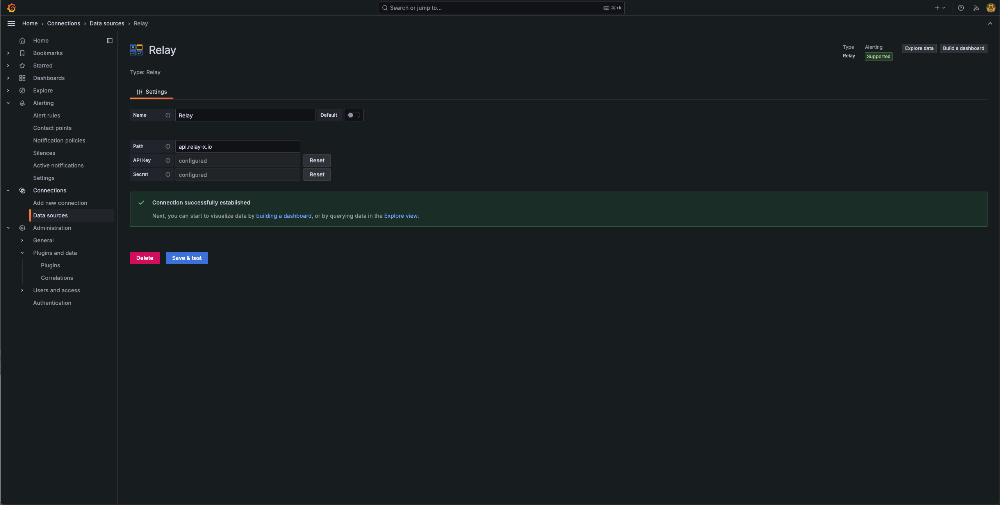

# Relay
<b>"Monitor the Unmonitorable: Real-Time Insights for Your Mission-Critical Systems"</b> 
The Grafana Real-Time Data Source Plugin is designed for mission-critical observability, enabling you to monitor and act on live data from cyber-physical systems like rockets, rovers, EV charging stations, and more. With seamless integration with Node.js and Python libraries, flexible messaging APIs, and real-time alerting, this tool empowers you to customize and scale your monitoring to meet the demands of your unique applications.

## Features
1. <b>Custom Data Structures:</b> Visualize user-defined data structures, allowing complete flexibility to adapt to your system's unique requirements.
2. <b>Real-Time Alerting:</b> Set up instant alerts based on live data streams to ensure you're always informed of critical events.
3. <b>Seamless Integration:</b> Publish data effortlessly using Node.js and Python libraries, making it easy to integrate with your existing workflows.
4. <b>Low-Latency Streaming:</b> Achieve near-zero delay in data visualization, perfect for monitoring fast-moving systems like rockets, rovers, and EVs.
5. <b>Real-Time Dashboards:</b> Create interactive Grafana dashboards for live data visualization tailored to your operational needs.
6. <b>Configurable Alerting Rules:</b> Define custom alert thresholds and conditions to receive actionable insights from your data streams.
7. <b>Cyber-Physical System Ready:</b> Specifically designed for real-time observability of complex systems like IoT devices, EV infrastructure, and space missions.

## Version Compatibility
Minimum supported Grafana version => 10.4.0

## Setup
1. Obtain API key and secret key
2. Enter the API Key & Secret into their respective fields.
3. In the 'Path' field, enter `api.relay-x.io`
4. Click on the `Save & Test` button and expect a `Connection successfully established` message in green. If you get this, the data source is now setup.

## Example
Paint a scenario of that you are visualizing 
Setup dashboard and link topics and the time setting on the top right 
Run the script and show realtime data being populated on the graphs